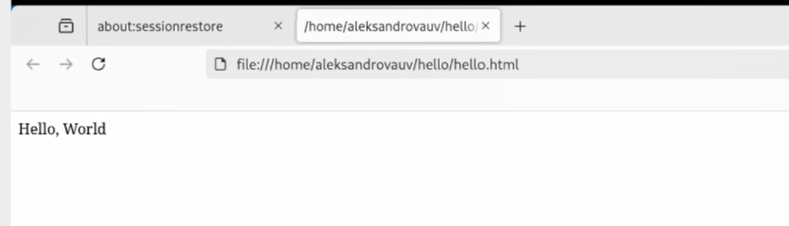

---
## Front matter
lang: ru-RU
title: Лабораторная работа №1
subtitle: Математическое моделирование
author:
  - Александрова Ульяна
institute:
  - Российский университет дружбы народов, Москва, Россия
date: 14 февраля 2025

## i18n babel
babel-lang: russian
babel-otherlangs: english

## Formatting pdf
toc: false
toc-title: Содержание
slide_level: 2
aspectratio: 169
section-titles: true
theme: metropolis
header-includes:
 - \metroset{progressbar=frametitle,sectionpage=progressbar,numbering=fraction}
---

# Информация

## Докладчик

:::::::::::::: {.columns align=center}
::: {.column width="70%"}

  * Александрова Ульяна
  * студентка 3го курса
  * Факультет физико-математических и естественных наук
  * Российский университет дружбы народов
  * [1132226444@rudn.ru](mailto:1132226444@rudn.ru)

:::
::: {.column width="30%"}

:::
::::::::::::::

# Цель работы

Целью данное работы является изучение и освоение утилиты Git.

# Теоретическое введение

Git — это распределённая система управления версиями, которая позволяет отслеживать изменения в файлах и координировать работу нескольких людей над проектом. Она была разработана Линусом Торвальдсом в 2005 году для управления разработкой ядра Linux.

# Выполнение лабораторной работы

## Работа с git

{#fig:001 width=70%}

## «Hello, World»

{#fig:002 width=70%}

## «Hello, World»

{#fig:003 width=70%}

## 1.4 Индексация изменений

{#fig:010 width=70%}

## 

{#fig:011 width=70%}

`hello.html` указан дважды в состоянии. Первое изменение (добавление стандартных тегов) проиндексировано и готово к коммиту. Второе изменение (добавление заголовков HTML) является непроиндексированным. Если бы я сделала коммит сейчас, заголовки не были бы сохранены в репозиторий. 

## История

{#fig:013 width=70%}

## Создание тегов версий

{#fig:017 width=70%}

## Просмотр тегов с помощью команды tag

{#fig:018 width=70%}

# Отмена изменений

## Отмена проиндексированных изменений (перед коммитом)

Команда `git reset` сбрасывает буферную зону к HEAD. Это очищает буферную зону от изменений, которые мы только что проиндексировали. Команда `git reset` (по умолчанию) не изменяет рабочий каталог. Поэтому рабочий каталог все еще содержит нежелательный комментарий

{#fig:025 width=70%}

## Отмена коммитов

{#fig:026 width=70%}

# Внесение изменений в коммиты

## Изменение предыдущий коммит

{#fig:032 width=70%}

## Просмотр истории

{#fig:033 width=70%}

Мы можем увидеть, что оригинальный коммит «автор» заменен коммитом «автор/email». Этого же эффекта можно достичь путем сброса последнего коммита в ветке, и повторного коммита новых изменений.

# Git внутри

## Каталог .git

{#fig:037 width=70%}

## 

{#fig:038 width=70%}

# Работа непосредственно с объектами git

## Вывод последнего коммита с помощью SHA1 хэша

{#fig:039 width=70%}

# Навигация по веткам

## Переключение между ветками

{#fig:047 width=70%}

## Файл README в ветке master

{#fig:048 width=70%}

## Просмотр отличающихся веток

{#fig:049 width=70%}

# Слияние

## Слияние веток

{#fig:051 width=70%}

# Разрешение конфликтов

## Слияние master с веткой style

{#fig:054 width=70%}

Первый раздел — версия текущей ветки (`style`). Второй раздел — версия ветки `master`.

## Решение конфликта

{#fig:055 width=70%}

# Сброс ветки master

## Сброс ветки master

{#fig:061 width=70%}

# Клонирование репозиториев

## Клонирование репозиториев

{#fig:064 width=70%}

# Выводы

Я освоила работу в Git.
