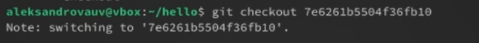
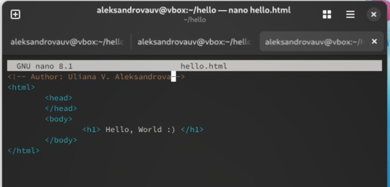

---
## Front matter
title: "Лабораторная работа №1"
subtitle: "Математическое моделированеи"
author: "Александрова Ульяна Вадимовна"

## Generic otions
lang: ru-RU
toc-title: "Содержание"

## Bibliography
bibliography: bib/cite.bib
csl: pandoc/csl/gost-r-7-0-5-2008-numeric.csl

## Pdf output format
toc: true # Table of contents
toc-depth: 2
lof: true # List of figures
lot: true # List of tables
fontsize: 12pt
linestretch: 1.5
papersize: a4
documentclass: scrreprt
## I18n polyglossia
polyglossia-lang:
  name: russian
  options:
	- spelling=modern
	- babelshorthands=true
polyglossia-otherlangs:
  name: english
## I18n babel
babel-lang: russian
babel-otherlangs: english
## Fonts
mainfont: IBM Plex Serif
romanfont: IBM Plex Serif
sansfont: IBM Plex Sans
monofont: IBM Plex Mono
mathfont: STIX Two Math
mainfontoptions: Ligatures=Common,Ligatures=TeX,Scale=0.94
romanfontoptions: Ligatures=Common,Ligatures=TeX,Scale=0.94
sansfontoptions: Ligatures=Common,Ligatures=TeX,Scale=MatchLowercase,Scale=0.94
monofontoptions: Scale=MatchLowercase,Scale=0.94,FakeStretch=0.9
mathfontoptions:
## Biblatex
biblatex: true
biblio-style: "gost-numeric"
biblatexoptions:
  - parentracker=true
  - backend=biber
  - hyperref=auto
  - language=auto
  - autolang=other*
  - citestyle=gost-numeric
## Pandoc-crossref LaTeX customization
figureTitle: "Рис."
tableTitle: "Таблица"
listingTitle: "Листинг"
lofTitle: "Список иллюстраций"
lotTitle: "Список таблиц"
lolTitle: "Листинги"
## Misc options
indent: true
header-includes:
  - \usepackage{indentfirst}
  - \usepackage{float} # keep figures where there are in the text
  - \floatplacement{figure}{H} # keep figures where there are in the text
---

# Цель работы

Целью данное работы является изучение и освоение утилиты Git.


# Теоретическое введение

Git — это распределённая система управления версиями, которая позволяет отслеживать изменения в файлах и координировать работу нескольких людей над проектом. Она была разработана Линусом Торвальдсом в 2005 году для управления разработкой ядра Linux.

Основные особенности Git:

1. **Распределённость**: Каждый разработчик имеет полную копию репозитория, включая всю историю изменений. Это позволяет работать автономно и синхронизировать изменения позже.
2. **Быстрота**: Git оптимизирован для высокой скорости выполнения операций.
3. **Эффективность хранения**: Git использует дельты и сжатие для эффективного хранения данных.
4. **Поддержка ветвления и слияния**: Git позволяет легко создавать и объединять ветки, что упрощает работу над новыми функциями и исправлением ошибок.

Основные команды Git:

- `git init`: Инициализация нового репозитория.
- `git clone`: Клонирование существующего репозитория.
- `git add`: Добавление изменений в индекс (стейджинг).
- `git commit`: Фиксация изменений в репозитории.
- `git push`: Отправка изменений в удалённый репозиторий.
- `git pull`: Получение изменений из удалённого репозитория и их слияние с локальной копией.

# Выполнение лабораторной работы

## Работа с git

### 1.1.1 Установка имени и электронной почты

У меня уже был подключен гитхаб на этой машине при помощи следующих команд:

```bash
git config --global user.name "Your Name"
git config --global user.email "your_email@whatever.com"
```
Как мы можем видеть, git работает успешно (рис. [-@fig:001]).

{#fig:001 width=70%}

### 1.1.3 Установка отображения unicode

По умолчанию, git будет печатать не-ASCII символы в именах файлов в виде восьмеричных последовательностей `\nnn`. Чтобы избежать нечитаемых строк, я установила соответствующий флаг.

```bash
git config --global core.quotepath off
```

### 1.2.1 Создайте страницу «Hello, World»

Начну работу в пустом рабочем каталоге с создания пустого каталога с именем `hello`, затем войду в него и создам там файл с именем `hello.html` (рис. [-@fig:002]) (рис. [-@fig:003]).

```
echo "Hello, World!" > hello.html
```

{#fig:002 width=70%}

{#fig:003 width=70%}

### 1.2.2 Создание репозитория

Чтобы создать git репозиторий из этого каталога, выполняю команду `git init` (рис. [-@fig:004]).

{#fig:004 width=70%}

### 1.2.3 Добавление файла в репозиторий и проверка состояния

Добавляю файл в репозиторий.

Используякоманду `git status`, проверияю текущее состояние репозитория.

```bash
git status
```

Коммитить нечего. Это означает, что в репозитории хранится текущее состояние рабочего каталога, и нет никаких изменений, ожидающих записи (рис. [-@fig:005]).

{#fig:005 width=70%}

Вот текст страниц 3-5 вашего PDF-документа в формате Markdown:

## 1.3 Внесение изменений

### 1.3.1 «Hello, World»

Добавляю HTML-теги к нашему приветствию. Изменяю содержимое файла `hello.html` на (рис. [-@fig:006]). 

```html
<h1>Hello, World!</h1>
```

{#fig:006 width=70%}

Проверяю состояние рабочего каталога.

## 1.4 Индексация изменений

Теперь выполняю команду `git add`, чтобы проиндексировать изменения (рис. [-@fig:007]). 

{#fig:007 width=70%}

Изменения файла `hello.html` были проиндексированы. Это означает, что Git теперь знает об изменении, но изменение пока не записано в репозиторий. Следующий коммит будет включать в себя проиндексированные изменения.

### 1.4.1 Коммит изменений

Делаю коммит и проверяю состояние (рис. [-@fig:008]). 

{#fig:008 width=70%}

Рабочий каталог чистый, можно продолжить работу.

### 1.4.2 Добавление стандартных тегов страницы

Изменяю страницу «Hello, World», чтобы она содержала стандартные теги `<html>` и `<body>` (рис. [-@fig:009]). 

{#fig:009 width=70%}

Теперь добавлю это изменение в индекс Git.

```bash
git add hello.html
```

Теперь добавляю заголовки HTML к странице «Hello, World» (рис. [-@fig:010]). 

{#fig:010 width=70%}

Проверяю текущий статус (рис. [-@fig:011]). 

{#fig:011 width=70%}


`hello.html` указан дважды в состоянии. Первое изменение (добавление стандартных тегов) проиндексировано и готово к коммиту. Второе изменение (добавление заголовков HTML) является непроиндексированным. Если бы я сделала коммит сейчас, заголовки не были бы сохранены в репозиторий. 

Коммичу проиндексированное изменение, а затем еще раз проверяю состояние (рис. [-@fig:012]). 

{#fig:012 width=70%}

Состояние команды говорит о том, что `hello.html` имеет незафиксированные изменения, но уже не в буферной зоне. 

### 1.4.3 История

Получим список произведенных изменений (рис. [-@fig:013]). 

{#fig:013 width=70%}

### 1.4.4 Получение старых версий

Возвращаться назад в историю очень просто. Команда `checkout` скопирует любой снимок из репозитория в рабочий каталог (рис. [-@fig:014]). 

{#fig:014 width=70%}

Просматриваю файл `hello.html` той версии и возвращаюсь к последней версии в ветке `master` (рис. [-@fig:015]). 

{#fig:015 width=70%}


### 1.4.5 Создание тегов версий

Называю текущую версию страницы `hello` первой (`v1`) (рис. [-@fig:016]). 

{#fig:016 width=70%}

Теперь текущая версия страницы называется `v1`.

#### Теги для предыдущих версий и переключение между версиями

Создаю тег для предыдущей версии через команду:

```bash
git checkout v1^
cat hello.html
```

Это версия с тегами `<html>` и `<body>`, но еще пока без `<head>`. Делаю ее версией `v1-beta`.

```bash
git tag v1-beta
```

Теперь пробую попереключаться между двумя отмеченными версиями (рис. [-@fig:017]). 

{#fig:017 width=70%}

### 1.4.7 Просмотр тегов с помощью команды tag

Просматриваю теги (рис. [-@fig:018]). 

{#fig:018 width=70%}

Мы можем видеть теги (`v1` и `v1-beta`) в логе вместе с именем ветки (`master`). Кроме того, `HEAD` показывает коммит, на который мы переключились (на данный момент это `v1-beta`).

## 1.5 Отмена локальных изменений (до индексации)

### 1.5.1 Переключение на ветку master и изменение hello.html

Иногда случается, что мы изменили файл в рабочем каталоге, и хотим отменить последние коммиты (рис. [-@fig:019]). 

{#fig:019 width=70%}

Вношу изменение в файл `hello.html` в виде нежелательного комментария.

```
<html>
  <head></head>
  <body>
    <h1>Hello, World!</h1>
    <!-- This is a bad comment. We want to revert it. -->
  </body>
</html>
```

## 1.6 Отмена проиндексированных изменений (перед коммитом)

### 1.6.1 Изменение файла

Вношу изменение в файл `hello.html` в виде нежелательного комментария.

```
<html>
  <head>
    <!-- This is an unwanted but staged comment -->
  </head>
  <body>
    <h1>Hello, World!</h1>
  </body>
</html>
```

Проиндексирую это изменение.

```bash
git add hello.html
```

### 1.6.3 Сброс буферной зоны

Команда `git reset` сбрасывает буферную зону к HEAD. Это очищает буферную зону от изменений, которые мы только что проиндексировали. Команда `git reset` (по умолчанию) не изменяет рабочий каталог. Поэтому рабочий каталог все еще содержит нежелательный комментарий (рис. [-@fig:025]). 

{#fig:025 width=70%}

## 1.7 Отмена коммитов

### 1.7.1 Отмена коммитов

Изменяю файл `hello.html` на следующий.

```html
<html>
  <head></head>
  <body>
    <h1>Hello, World!</h1>
    <!-- This is an unwanted but committed change -->
  </body>
</html>
```
Произвожу коммит и отменяю через `git revert HEAD` и просматриваю лог (рис. [-@fig:026]) (рис. [-@fig:028]).

{#fig:026 width=70%}

{#fig:028 width=70%}

## 1.9 Удаление тега oops

### 1.9.1 Удаление тега oops

Тег `oops` свою функцию выполнил. Удалю его и коммиты, на которые он ссылался, сборщиком мусора.

```bash
git tag -d oops
git log --all
```

Тег «oops» больше не будет отображаться в репозитории (рис. [-@fig:029]).

{#fig:029 width=70%}

## 1.10 Внесение изменений в коммиты

### 1.10.1 Изменение страницы

Добавляю в страницу комментарий автора (рис. [-@fig:030]).

{#fig:030 width=70%}

Выполняю:

```bash
git add hello.html
git commit -m "Add an author comment"
```

### 1.10.2 Необходим email

Добавляю email (рис. [-@fig:031]).

{#fig:031 width=70%}

### 1.10.3 Измените предыдущий коммит

Коммичу (рис. [-@fig:032]).

{#fig:032 width=70%}

### 1.10.4 Просмотр истории

Выполняю (рис. [-@fig:029]).

{#fig:033 width=70%}

Мы можем увидеть, что оригинальный коммит «автор» заменен коммитом «автор/email». Этого же эффекта можно достичь путем сброса последнего коммита в ветке, и повторного коммита новых изменений.

## 1.11 Перемещение файлов

### 1.11.1 Перемещение в каталог lib

Создаю новый репозиторий и коммичу изменения (рис. [-@fig:034]).

{#fig:034 width=70%}

## 1.13 Подробнее о структуре

### 1.13.1 Добавление index.html

Добавим файл `index.html` в наш репозиторий.

```html
<html>
  <body>
    <iframe src="lib/hello.html" width="200" height="200"></iframe>
  </body>
</html>
```

Добавляю файл и делаю коммит (рис. [-@fig:036]).

{#fig:036 width=70%}

Теперь при открытии `index.html`, вы должны увидеть кусок страницы `hello` в маленьком окошке.

### 1.14 Git внутри: Каталог .git

#### 1.14.1 Каталог .git

Выполняю команду (рис. [-@fig:029]):

```bash
ls -C .git
```
Это каталог, в котором хранится вся информация git.

```bash
ls -C .git/objects
```

Мы видим набор каталогов, имена которых состоят из 2 символов. Имена каталогов являются первыми двумя буквами хэша `sha1` объекта, хранящегося в git.

```bash
ls -C .git/objects/<dir>
```

Смотрю в один из каталогов с именем из 2 букв. Мы видим файлы с именами из 38 символов. Это файлы, содержащие объекты, хранящиеся в git. Они сжаты и закодированы, поэтому просмотр их содержимого нам мало чем поможет.

```bash
cat .git/config
```

Это файл конфигурации, создающийся для каждого конкретного проекта. Записи в этом файле будут перезаписывать записи в файле `.gitconfig` вашего главного каталога, по крайней мере в рамках этого проекта.

{#fig:037 width=70%}

```bash
ls .git/refs
ls .git/refs/heads
ls .git/refs/tags
cat .git/refs/tags/v1
```

Я узнаю файлы в подкаталоге тегов. Каждый файл соответствует тегу, ранее созданному с помощью команды `git tag`. Его содержание — это всего лишь хэш коммита, привязанный к тегу. Каталог `heads` практически аналогичен, но используется для веток, а не тегов. На данный момент у нас есть только одна ветка, так что все, что мы видим в этом каталоге – это ветка `master` (рис. [-@fig:038]).

{#fig:038 width=70%}

Файл `HEAD` содержит ссылку на текущую ветку, в данный момент это ветка `master`.


## 1.15 Работа непосредственно с объектами git

### 1.15.2 Вывод последнего коммита с помощью SHA1 хэша

Ищу последний коммит (рис. [-@fig:039]).

{#fig:039 width=70%}

Мне удалось найти оригинальный файл `hello.html` с самого первого коммита вручную по ссылкам SHA1 хэша в последнем коммите.

## 1.16 Создание ветки

Пора сделать наш hello world более выразительным. Так как это может занять некоторое время, лучше переместить эти изменения в отдельную ветку, чтобы изолировать их от изменений в ветке master (рис. [-@fig:040]).

{#fig:040 width=70%}

### 1.16.2 Добавьте файл стилей style.css

Создаю файл `lib/style.css`:

```css
h1 {
  color: red;
}
```

И выполняю:

```bash
git add lib/style.css
git commit -m "Added css stylesheet"
```

### 1.16.3 Изменение основной страницы

Обновляю файл `hello.html`, чтобы использовать стили `style.css` (рис. [-@fig:042]) (рис. [-@fig:043]).

{#fig:042 width=70%}

{#fig:043 width=70%}

Произвожу необходимые коммиты (рис. [-@fig:044]).

{#fig:044 width=70%}

### 1.16.4 Изменение index.html

Обновляю файл `index.html`, чтобы он тоже использовал `style.css`.

```html
<html>
  <head>
    <link type="text/css" rel="stylesheet" media="all" href="lib/style.css" />
  </head>
  <body>
    <iframe src="lib/hello.html" width="200" height="200"></iframe>
  </body>
</html>
```

И выполняю:

```bash
git add index.html
git commit -m "Updated index.html"
```

## 1.17 Навигация по веткам

Просмотрю каталог (рис. [-@fig:046]).

{#fig:046 width=70%}

### 1.17.1 Переключение между ветками

Сейчас мы находимся на ветке `master`. Это заметно по тому, что файл `hello.html` не использует стили `style.css`.

Переключимся обратно. содержимое `lib/hello.html` подтверждает, что мы вернулись на ветку `style` (рис. [-@fig:047]).

{#fig:047 width=70%}

##.18 Изменения в ветке master

### 1.18.1 Файл README в ветке master

Создаю файл README.md (рис. [-@fig:048]).

{#fig:048 width=70%}

### 1.19.1 Просмотр отличающихся веток

### 1.19.2 Текущие ветки

Теперь у нас в репозитории есть две отличающиеся ветки (рис. [-@fig:049]).

{#fig:049 width=70%}

Добавление опции `--graph` в `git log` вызывает построение дерева коммитов с помощью простых ASCII символов. Мы видим обе ветки (`style` и `master`), и то, что ветка `master` является текущей `HEAD`. Общим предшественником обеих веток является коммит «Added index.html». Опция `--all` гарантированно означает, что мы видим все ветки. По умолчанию показывается только текущая ветка.

## 1.20 Слияние

### 1.20.1 Слияние веток

Слияние переносит изменения из двух веток в одну. Сольем `master` с `style` (рис. [-@fig:050]) (рис. [-@fig:051]).

{#fig:050 width=70%}

{#fig:051 width=70%}

## 1.21 Создание конфликта

### 1.21.1 Вернитесь в master и создайте конфликт

Вернитесь в ветку `master` и внесу изменения в документ (рис. [-@fig:052]).

{#fig:052 width=70%}

Отправлю изменения:

```bash
git add lib/hello.html
git commit -m 'Life is great'
```

### 1.21.2 Просмотр веток

После коммита «Added README» ветка `master` была объединена с веткой `style`, но в настоящее время в `master` есть дополнительный коммит, который не был слит с `style`. Последнее изменение в `master` конфликтует с некоторыми изменениями в `style` (рис. [-@fig:053]).

{#fig:053 width=70%}

## 1.22 Разрешение конфликтов

### 1.22.1 Слияние master с веткой style

Теперь вернусь к ветке `style` и попытаюсь объединить ее с новой веткой `master`.

```bash
git checkout style
git merge master
```

В файле`lib/hello.html` мы видим  (рис. [-@fig:054]).

{#fig:054 width=70%}

Первый раздел — версия текущей ветки (`style`). Второй раздел — версия ветки `master`.

### 1.22.2 Решение конфликта

Для решения конфликта, вношу изменения (рис. [-@fig:055]).

{#fig:055 width=70%}

И выполняю коммит:

```bash
git add lib/hello.html
git commit -m "Merged master fixed conflict."
```

## 1.23 Сброс ветки style

### 1.23.1 Сброс ветки style

Вернемся на ветке `style` к точке перед тем, как мы слили ее с веткой `master`. Мы можем сбросить ветку к любому коммиту. По сути, это изменение указателя ветки на любую точку дерева коммитов. В этом случае мы хотим вернуться в ветке `style` в точку перед слиянием с `master`. Нам необходимо найти последний коммит перед слиянием.

Мы видим, что коммит «Updated index.html» был последним на ветке `style` перед слиянием. Сбросим ветку `style` к этому коммиту (рис. [-@fig:059]).

{#fig:059 width=70%}

## 1.24 Сброс ветки master

### 1.24.1 Сброс ветки master

Добавив интерактивный режим в ветку `master`, мы внесли изменения, конфликтующие с изменениями в ветке `style`. Вернусь в ветке `master` в точку перед внесением конфликтующих изменений (рис. [-@fig:060]).

{#fig:060 width=70%}

Коммит «Added README» идет непосредственно перед коммитом конфликтующего интерактивного режима. Мы сбросим ветку `master` к коммиту «Added README» (рис. [-@fig:061]).

{#fig:061 width=70%}

Лог выглядит, как будто репозиторий был перемотан назад во времени к точке до какого-либо слияния.

## 1.25 Перебазирование

Используем команду `rebase` вместо команды `merge` (рис. [-@fig:062]).

{#fig:062 width=70%}

## 1.26 Слияние в ветку master

Мы поддерживали соответствие ветки `style` с веткой `master` (с помощью `rebase`), теперь давайте солью изменения `style` в ветку `master` (рис. [-@fig:063]).

{#fig:063 width=70%}

## 1.27 Клонирование репозиториев

### 1.27.1 Клонирование репозиториев

Делаю клон своего рабочего каталога `hello` в домашнем репозитории (рис. [-@fig:064]).

{#fig:064 width=70%}


## 1.28 Работа с клонированный репозиторием

### 1.28.1 Лог

Просмотрим лог (рис. [-@fig:065]).

{#fig:065 width=70%}

Мы видим список всех коммитов в новый репозиторий.

## 1.29 Что такое origin?

Рассмотрим, что такое origin (рис. [-@fig:066]).

{#fig:066 width=70%}

Удаленные репозитории обычно размещаются на отдельной машине, возможно, централизованном сервере. Однако, как мы видим здесь, они могут с тем же успехом указывать на репозиторий на той же машине.

## 1.31 Изменение оригинального репозитория

### 1.31.1 Внесение изменения в оригинальный репозиторий hello

Сейчас мы находимся в репозитории `hello`. Вношу следующие изменения в файл `README.md`:

```
This is the Hello World example from the git tutorial.
```

Теперь в оригинальном репозитории есть более поздние изменения, которых нет в клонированной версии. Далее мы извлечем и сольем эти изменения в клонированный репозиторий.

### 1.31.2 Извлечение изменений

Извлекаю изменения (рис. [-@fig:068]).

{#fig:068 width=70%}

Мы можем продемонстрировать, что клонированный файл `README.md` не изменился. Поэтому я сливаю изменения в локальную ветку master. Теперь изменения есть (рис. [-@fig:070]).

{#fig:070 width=70%}

## 1.33 Добавление ветки наблюдения

### 1.33.1 Добавление локальной ветки, которая отслеживает удаленную

Добавляю и открываю лог (рис. [-@fig:071]).

{#fig:071 width=70%}

## 1.35 Создайте чистый репозиторий

Выполняю:

```bash
cd ..
git clone --bare hello hello.git
ls hello.git
```

## 1.36 Добавление удаленного репозитория

Теперь добавляю репозиторий `hello.git` к оригинальному репозиторию.

```bash
cd hello
git remote add shared ../hello.git
```

## 1.37 Отправка изменений

Редактирую файл `README.md` и делаю коммит.

Файл `README.md`:

```
This is the Hello World example from the git tutorial. (Changed in the original and pushed to shared)
```

```bash
git checkout master
git add README
git commit -m "Added shared comment to readme"
```

Теперь отправляю изменения в общий репозиторий:

```bash
git push shared master
```

## 1.38 Извлечение общих изменений

Извлекаю общие изменения (рис. [-@fig:072]).

{#fig:072 width=70%}

# Выводы

Я освоила работу в Git.
