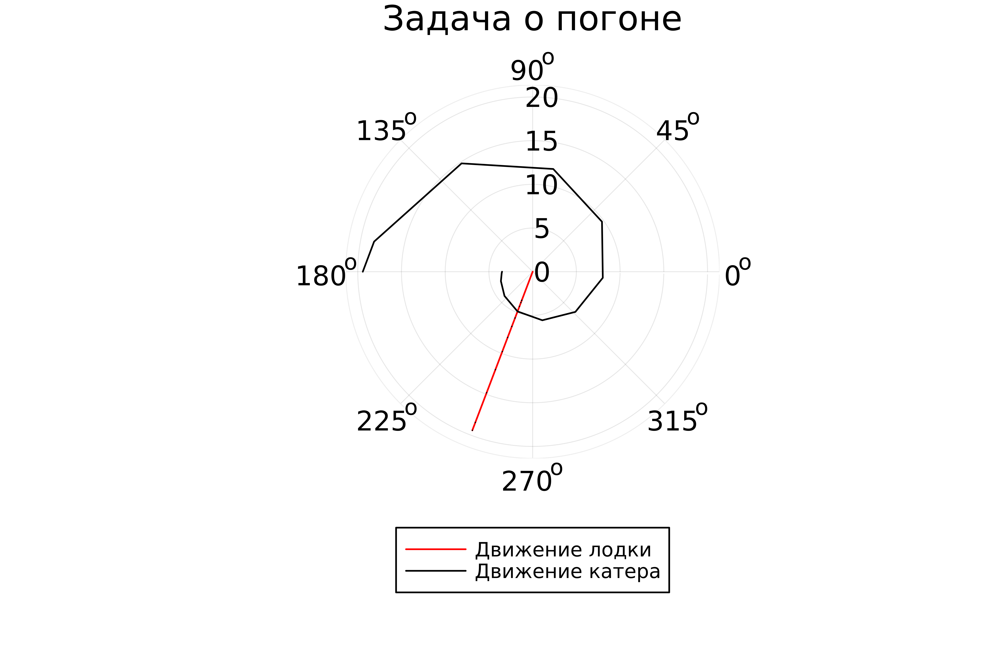

---
## Front matter
lang: ru-RU
title: Лабораторная работа №2
subtitle: Математическое моделирование
author:
  - Александрова УВ
institute:
  - Российский университет дружбы народов, Москва, Россия
date: 6 марта 2025

## i18n babel
babel-lang: russian
babel-otherlangs: english

## Formatting pdf
toc: false
toc-title: Содержание
slide_level: 2
aspectratio: 169
section-titles: true
theme: metropolis
header-includes:
 - \metroset{progressbar=frametitle,sectionpage=progressbar,numbering=fraction}
---

# Информация

## Докладчик

:::::::::::::: {.columns align=center}
::: {.column width="70%"}

  * Александрова Ульяна
  * студентка 3го курса
  * Факультет физико-математических и естественных наук
  * Российский университет дружбы народов
  * [1132226444@rudn.ru](mailto:1132226444@rudn.ru)

:::
::: {.column width="30%"}

:::
::::::::::::::

# Цель работы

Цель работы - решить задачу о погоне и наглядно продемонстрировать результаты работы при помощи утилиты Julia.

# Задача о погоне

ВАРИАНТ 23.

На море в тумане катер береговой охраны преследует лодку браконьеров. Через определенный промежуток времени туман рассеивается, и лодка обнаруживается на расстоянии 9,8 км от катера. Затем лодка снова скрывается в тумане и уходит прямолинейно в неизвестном направлении. Известно, что скорость катера в 3,8 раза больше скорости браконьерской лодки. 
1. Запишите уравнение, описывающее движение катера, с начальными условиями для двух случаев (в зависимости от расположения катера относительно лодки в начальный момент времени).  
2. Постройте траекторию движения катера и лодки для двух случаев.  
3. Найдите точку пересечения траектории катера и лодки.  

# Выполнение лабораторной работы

{#fig:001 width=70%}

##

{#fig:002 width=70%}

# Выводы

Я создала модель задачи о погоне при помощи утилиты Julia.

