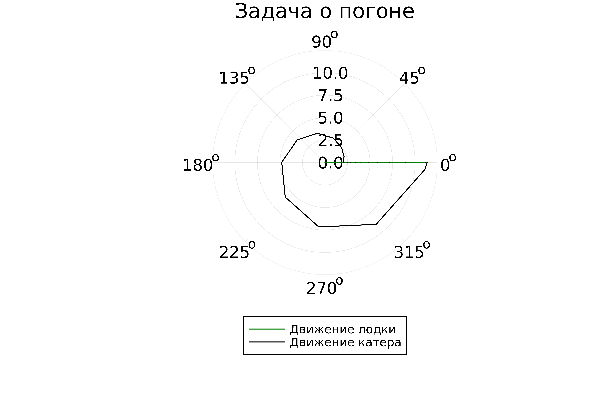

---
## Front matter
title: "Лабораторная работа №2"
subtitle: "Математическое моделирование"
author: "Александрова Ульяна Вадимовна"

## Generic otions
lang: ru-RU
toc-title: "Содержание"

## Bibliography
bibliography: bib/cite.bib
csl: pandoc/csl/gost-r-7-0-5-2008-numeric.csl

## Pdf output format
toc: true # Table of contents
toc-depth: 2
lof: true # List of figures
lot: true # List of tables
fontsize: 12pt
linestretch: 1.5
papersize: a4
documentclass: scrreprt
## I18n polyglossia
polyglossia-lang:
  name: russian
  options:
	- spelling=modern
	- babelshorthands=true
polyglossia-otherlangs:
  name: english
## I18n babel
babel-lang: russian
babel-otherlangs: english
## Fonts
mainfont: IBM Plex Serif
romanfont: IBM Plex Serif
sansfont: IBM Plex Sans
monofont: IBM Plex Mono
mathfont: STIX Two Math
mainfontoptions: Ligatures=Common,Ligatures=TeX,Scale=0.94
romanfontoptions: Ligatures=Common,Ligatures=TeX,Scale=0.94
sansfontoptions: Ligatures=Common,Ligatures=TeX,Scale=MatchLowercase,Scale=0.94
monofontoptions: Scale=MatchLowercase,Scale=0.94,FakeStretch=0.9
mathfontoptions:
## Biblatex
biblatex: true
biblio-style: "gost-numeric"
biblatexoptions:
  - parentracker=true
  - backend=biber
  - hyperref=auto
  - language=auto
  - autolang=other*
  - citestyle=gost-numeric
## Pandoc-crossref LaTeX customization
figureTitle: "Рис."
tableTitle: "Таблица"
listingTitle: "Листинг"
lofTitle: "Список иллюстраций"
lotTitle: "Список таблиц"
lolTitle: "Листинги"
## Misc options
indent: true
header-includes:
  - \usepackage{indentfirst}
  - \usepackage{float} # keep figures where there are in the text
  - \floatplacement{figure}{H} # keep figures where there are in the text
---

# Цель работы

Цель работы - решить задачу о погоне и наглядно продемонстрировать результаты работы при помощи утилиты Julia.

# Задача о погоне

ВАРИАНТ 23.

На море в тумане катер береговой охраны преследует лодку браконьеров. Через определенный промежуток времени туман рассеивается, и лодка обнаруживается на расстоянии 9,8 км от катера. Затем лодка снова скрывается в тумане и уходит прямолинейно в неизвестном направлении. Известно, что скорость катера в 3,8 раза больше скорости браконьерской лодки. 
1. Запишите уравнение, описывающее движение катера, с начальными условиями для двух случаев (в зависимости от расположения катера относительно лодки в начальный момент времени).  
2. Постройте траекторию движения катера и лодки для двух случаев.  
3. Найдите точку пересечения траектории катера и лодки.  

### Постановка задачи

1. Принимаем за$t_0 = 0$,$x_0 = 0$- место нахождения лодки браконьеров в момент обнаружения,$x_k = 9.8$- место нахождения катера береговой охраны относительно лодки браконьеров в момент обнаружения лодки.
2. Введем полярные координаты. Считаем, что полюс - это точка обнаружения лодки браконьеров$x_0$($x_0 = \theta = 0$), а полярная ось проходит через точку нахождения катера береговой охраны.
\]

3. Траектория катера должна быть такой, чтобы и катер, и лодка все время были на одном расстоянии от полюса, только в этом случае траектория катера пересечется с траекторией лодки. Поэтому для начала катер береговой охраны должен двигаться некоторое время прямолинейно, пока не окажется на том же расстоянии от полюса, что и лодка браконьеров. После этого катер береговой охраны должен двигаться вокруг полюса, удаляясь от него с той же скоростью, что и лодка браконьеров.
4. Чтобы найти расстояние$x$(расстояние после которого катер начнет двигаться вокруг полюса), необходимо составить простое уравнение. Пусть через время$t$катер и лодка окажутся на одном расстоянии$x$от полюса. За это время лодка пройдет$x$, а катер$9,8 - x$(или$9,8 + x$, в зависимости от начального положения катера относительно полюса). Время, за которое они пройдут это расстояние, вычисляется как$\frac{x}{v}$или$\frac{9,8 - x}{3,8v}$(во втором случае -$\frac{9,8 + x}{3,8v}$). Так как время одно и то же, то эти величины одинаковы. Тогда неизвестное расстояние$x$можно найти из следующего уравнения:

$$\frac{x}{v} = \frac{9,8 - x}{3,8v}$$

в первом случае или

$$\frac{x}{v} = \frac{9,8 + x}{3,8v}$$

во втором.

Отсюда мы найдем два значения$x_1 = \frac{9,8}{4,8}$ и $x_2 = \frac{9,8}{2,8}$, задачу будем решать для двух случаев.

5. После того, как катер береговой охраны окажется на одном расстоянии от полюса, что и лодка, он должен сменить прямолинейную траекторию и начать двигаться вокруг полюса, удаляясь от него со скоростью лодки$v$. Для этого скорость катера раскладываем на две составляющие:$v_r$- радиальная скорость$v_r = \frac{dr}{dt} = v$и$v_\theta$- тангенциальная скорость$v_\theta = \frac{d \theta}{dt}r$.

6. Решение исходной задачи сводится к решению системы из двух дифференциальных уравнений:

$$\frac{dr}{dt} = v$$
$$r \frac{d\theta}{dt} = \sqrt{13,44}v$$

с начальными условиями$\theta (0) = 0$или$r(0) = \frac{49}{24}$

или

$$\begin{cases}
&{\theta}_0 = -\pi\\  \tag{2}
&r_0 = \dfrac{7}{2}
\end{cases}$$

Исключая из полученной системы производную по$t$, можно перейти к следующему уравнению:

$$\frac{dr}{d\theta} = \frac{r}{\sqrt{13,44}}$$

Начальные условия остаются прежними. Решив это уравнение, получим траекторию движения катера в полярных координатах.

# Выполнение лабораторной работы

## Построение траектории движения катера береговой охраны.

```julia
## код для случая 9,8 - x

using Plots
using DifferentialEquations

# constanty 
const k = 9.8
const v = 3.8
const r0 = k / 4.8
const r0_2 = k / 2.8
const t = (0.0, 2*pi)
const t2 = (-pi, pi)

# kater

function kater(r, p, t)
	return r / sqrt(v*v - 1)
end

odu = ODEProblem(kater, r0, t)

result = solve(odu, abstol=1e-8, reltol=1e-8)
random = rand(1:size(result.t)[1])
ran_angles = [result.t[random] for i in 1:size(result.t)[1]]

plt = plot(proj=:polar, aspect_ratio=:equal, dpi = 1000, legend=true)

plot!(plt, xlabel="t", ylabel="r(t)", title="Задача о погоне", legend=:outerbottom)
plot!(plt, [ran_angles[1], ran_angles[2]], [0.0, result.u[size(result.u)[1]]], label="Движение лодки", color=:green, lw=1)
scatter!(plt, ran_angles, result.u, label="", mc=:green, ms=0.0005)
plot!(plt, result.t, result.u, xlabel="t", ylabel="r(t)", label="Движение катера", color=:black, lw=1)
scatter!(plt, result.t, result.u, label="", mc=:black, ms=0.0005)

savefig(plt, "math_m_lab2_01.png")

```

Получаем график движения лодки и катера для случая 1 (рис. [-@fig:001]).

{#fig:001 width=70%}

На графике мы видим траекторию движения лодки браконьеров (зеленый) и катера охраны (черный).

Теперь решим задачу для второго случая 

```julia

using Plots
using DifferentialEquations

# constanty 
const k = 9.8
const v = 3.8
const r0 = k / 4.8
const r0_2 = k / 2.8
const t = (0.0, 2*pi)
const t2 = (-pi, pi)

# kater

function kater(r, p, t)
	return r / sqrt(v*v - 1)
end

odu = ODEProblem(kater, r0_2, t2)

result = solve(odu, abstol=1e-8, reltol=1e-8)
random = rand(1:size(result.t)[1])
ran_angles = [result.t[random] for i in 1:size(result.t)[1]]

plt = plot(proj=:polar, aspect_ratio=:equal, dpi = 1000, legend=true)

plot!(plt, xlabel="t", ylabel="r(t)", title="Задача о погоне", legend=:outerbottom)
plot!(plt, [ran_angles[1], ran_angles[2]], [0.0, result.u[size(result.u)[1]]], label="Движение лодки", color=:red, lw=1)
scatter!(plt, ran_angles, result.u, label="", mc=:red, ms=0.0005)
plot!(plt, result.t, result.u, xlabel="t", ylabel="r(t)", label="Движение катера", color=:black, lw=1)
scatter!(plt, result.t, result.u, label="", mc=:black, ms=0.0005)

savefig(plt, "math_m_lab2_02.png")
```

ПОлучаем следующий график (рис. [-@fig:002]).

{#fig:002 width=70%}

На графике точно видны точки пересечения траекторий движения ложки и катера.

# Выводы

Я создала модель задачи о погоне при помощи утилиты Julia.


