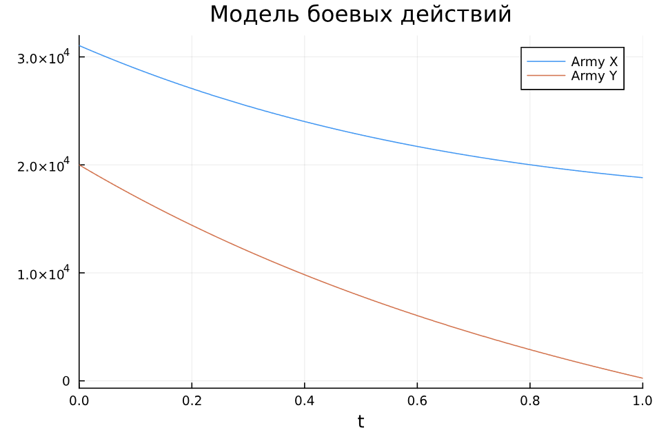
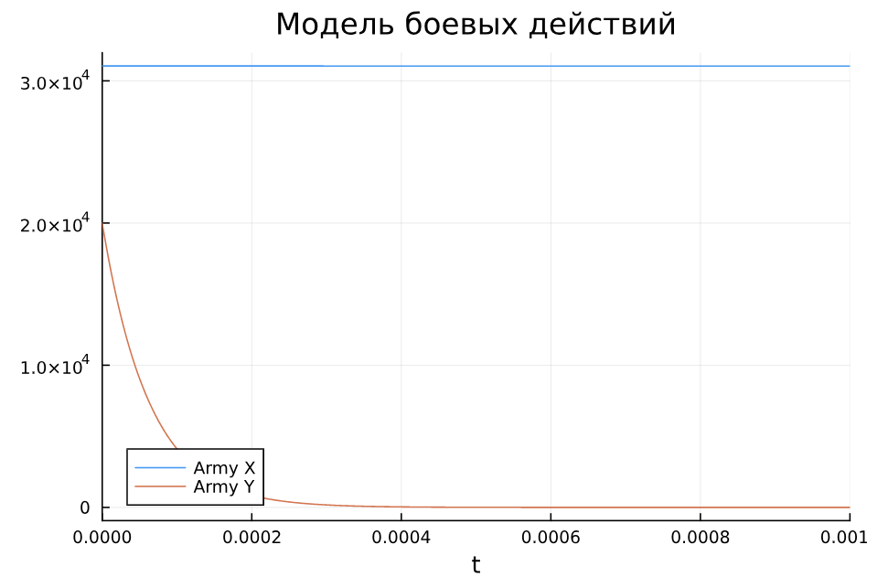

---
## Front matter
lang: ru-RU
title: Лабораторная работа №3
subtitle: Математическое моделирование
author:
  - Александрова УВ
institute:
  - Российский университет дружбы народов, Москва, Россия
date: 22 марта 2025

## i18n babel
babel-lang: russian
babel-otherlangs: english

## Formatting pdf
toc: false
toc-title: Содержание
slide_level: 2
aspectratio: 169
section-titles: true
theme: metropolis
header-includes:
 - \metroset{progressbar=frametitle,sectionpage=progressbar,numbering=fraction}
---

# Информация

## Докладчик

:::::::::::::: {.columns align=center}
::: {.column width="70%"}

  * Александрова Ульяна
  * студентка 3го курса
  * Факультет физико-математических и естественных наук
  * Российский университет дружбы народов
  * [1132226444@rudn.ru](mailto:1132226444@rudn.ru)

:::
::: {.column width="30%"}

:::
::::::::::::::

# Цель работы

Целью работы является построение модели боевых действий на языке Julia.

# Задание

ВАРИАНТ 35

Между страной $X$ и страной $Y$ идет война. Численность состава войск исчисляется от начала войны, и являются временными функциями $x(t)$ и $y(t)$. В начальный момент времени страна $X$ имеет армию численностью 31 050  человек, а в распоряжении страны $Y$ армия численностью в 20 002 человек. Для упрощения модели считаем, что коэффициенты $a, b, c, h$ постоянны. Также считаем $P(t)$ и $Q(t)$ непрерывные функции.

Построить графики изменения численности войск армии $X$ и армии $Y$ для  следующих случаев:

## Задание

1. Модель боевых действий между регулярными войсками

$$\begin{cases}
    \dfrac{dx}{dt} = -0.25x(t)- 0.74y(t)+sin(t+5)\\
    \dfrac{dy}{dt} = -0.64x(t)- 0.55y(t)+cos(t+6)
\end{cases}$$

## Задание

2. Модель ведение боевых действий с участием регулярных войск и партизанских отрядов

$$\begin{cases}
    \dfrac{dx}{dt} = -0.32x(t)-0.89y(t)+2*sin(10t)\\
    \dfrac{dy}{dt} = -0.51x(t)y(t)-0.62y(t)+2*cos(10t)
\end{cases}$$

# Выполнение лабораторной работы

##

{#fig:001 width=60%}

Мы видим, что на графике побеждает армия Х, так как численность армии Y быстрее достигла нуля. Однако уменьшение численности армии происходит равномерно.

##

{#fig:002 width=60%}

По графику видно, что  уменьшение численность армии Y происходит мгновенно, вероятно из-за возникновения дополнительныз отрядов. При этом численность Армии X не почти не меняется со временем, так как она победила.

# Выводы

У меня получилось построить модель боевых действий в утилите Julia.
