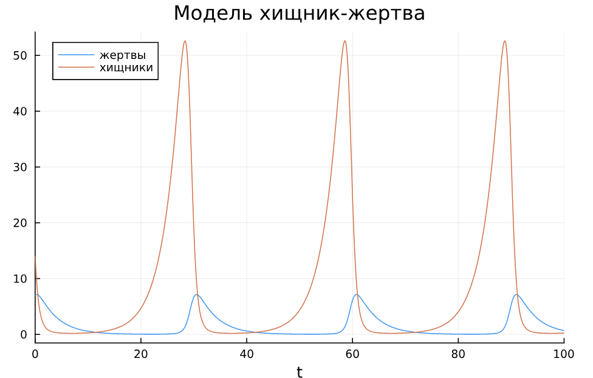
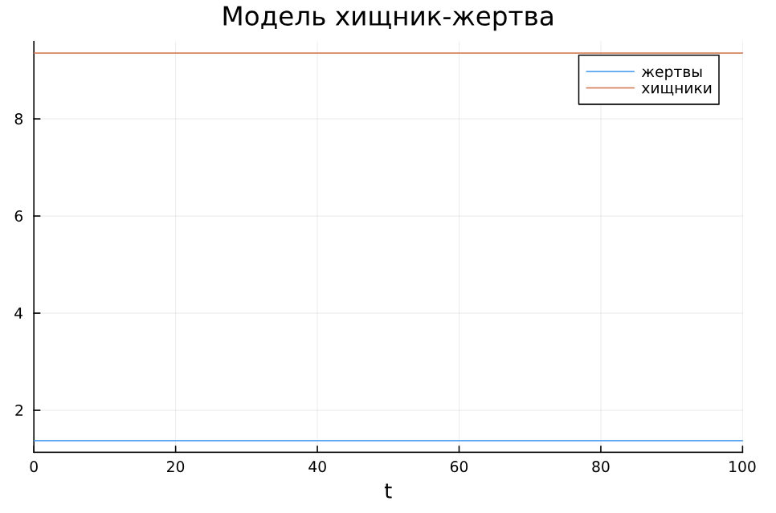

---
## Front matter
lang: ru-RU
title: Лабораторная работа №5
subtitle: Математическое моделирование
author:
  - Александрова УВ
institute:
  - Российский университет дружбы народов, Москва, Россия
date: 19 апреля 2025

## i18n babel
babel-lang: russian
babel-otherlangs: english

## Formatting pdf
toc: false
toc-title: Содержание
slide_level: 2
aspectratio: 169
section-titles: true
theme: metropolis
header-includes:
 - \metroset{progressbar=frametitle,sectionpage=progressbar,numbering=fraction}
---

# Информация

## Докладчик

:::::::::::::: {.columns align=center}
::: {.column width="70%"}

  * Александрова Ульяна
  * студентка 3го курса
  * Факультет физико-математических и естественных наук
  * Российский университет дружбы народов
  * [1132226444@rudn.ru](mailto:1132226444@rudn.ru)

:::
::: {.column width="30%"}


:::
::::::::::::::

# Цель работы

Целью данной лабораторной работы является создание модели Хищник-Жертва на языке Julia.

# Задание

$$\begin{cases}
    &\dfrac{dx}{dt} = - 0.29 x(t) + 0.031 x(t)y(t) \\
    &\dfrac{dy}{dt} = 0.33 y(t) - 0.24 x(t)y(t)
\end{cases}$$

Построить график зависимости численности хищников от численности жертв,
а также графики изменения численности хищников и численности жертв при
следующих начальных условиях:
$$x_0 = 7, y_0 = 14.$$
Найти стационарное состояние системы.

# Теоретическое введение

Модель Лотки - Волтерры — модель взаимодействия двух видов типа «хищник — жертва», названная в честь своих авторов (Лотка, 1925; Вольтерра 1926), которые предложили модельные уравнения независимо друг от друга.

Такие уравнения можно использовать для моделирования систем «хищник — жертва», «паразит — хозяин», конкуренции и других видов взаимодействия между двумя видами.

##

В математической форме предложенная система имеет следующий вид:

$$\begin{cases}
    &\dfrac{dx}{dt} = \alpha x(t) - \beta x(t)y(t) \\
    &\dfrac{dy}{dt} = -\gamma y(t) + \delta x(t)y(t)
\end{cases}$$

где 
$\displaystyle x$ — количество жертв, 

$\displaystyle y$ — количество хищников, 

${\displaystyle t}$ — время, 

${\displaystyle \alpha ,\beta ,\gamma ,\delta }$ — коэффициенты, отражающие взаимодействия между видами.


# Выполнение лабораторной работы

```
using DifferentialEquations, Plots;

function LV(u, p, t)
    x, y = u
    a, b, c, d = p
    dx = a*x - b*x*y
    dy = -c*y + d*x*y
    return [dx, dy]
end  
    

u0 = [7, 14]
p = [-0.29, -0.031, -0.33, -0.24]
tspan = (0,100)

odu = ODEProblem(LV, u0, tspan, p)

result = solve(odu, Tsit5())

plot(result, title = "Модель хищник-жертва", label = ["жертвы" "хищники"], dpi = 300)

```

##

{#fig:001 width=70%}

# Найдем стационарное распределение 

$$\begin{cases}
  &x_0 = \dfrac{c}{d}\\
  &y_0 = \dfrac{a}{b}
\end{cases}
$$

```
x0 = p[3]/p[4]
y0 = p[1]/p[2]
u0_0 = [x0, y0]
prob2 = ODEProblem(LV, u0_0, tspan, p)
result2 = solve(prob2, Tsit5())

plot(result2, title = "Модель хищник-жертва", label = ["жертвы" "хищники"], dpi = 300)

```

##

{#fig:002 width=70%}

# Выводы

Я построила модель Лотки - Волтерры на языке Julia.

# Список литературы{.unnumbered}

[Лабораторная работа №5](https://esystem.rudn.ru/mod/resource/view.php?id=1222502)

:::
