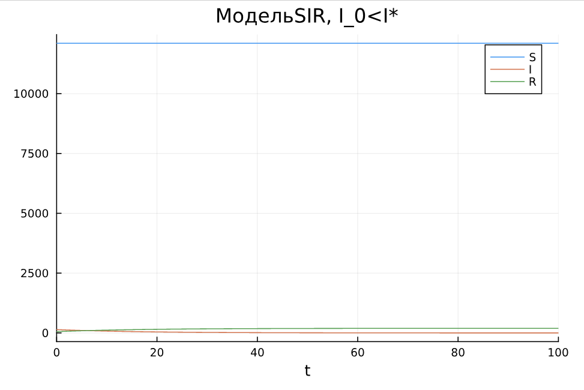

---
## Front matter
lang: ru-RU
title: Лабораторная работа №6
subtitle: Математическое моделирование
author:
  - Александрова УВ
institute:
  - Российский университет дружбы народов, Москва, Россия
date: 3 мая 2025

## i18n babel
babel-lang: russian
babel-otherlangs: english

## Formatting pdf
toc: false
toc-title: Содержание
slide_level: 2
aspectratio: 169
section-titles: true
theme: metropolis
header-includes:
 - \metroset{progressbar=frametitle,sectionpage=progressbar,numbering=fraction}
---

# Информация

## Докладчик

:::::::::::::: {.columns align=center}
::: {.column width="70%"}

  * Александрова Ульяна
  * студентка 3го курса
  * Факультет физико-математических и естественных наук
  * Российский университет дружбы народов
  * [1132226444@rudn.ru](mailto:1132226444@rudn.ru)

:::
::: {.column width="30%"}


:::
::::::::::::::

# Цель работы

Построить модели эпидемии SIR на языке Julia.

# Задание

**Вариант 35.**

На одном острове вспыхнула эпидемия. Известно, что из всех проживающих на острове 
$(N=12300)$ в момент начала эпидемии $(t=0)$ число заболевших людей 
(являющихся распространителями инфекции) $I(0)=140$, А число здоровых людей с иммунитетом 
к болезни $R(0)=54$. Таким образом, число людей восприимчивых к болезни, 
но пока здоровых, в начальный момент времени $S(0)=N-I(0)-R(0)$.
Постройте графики изменения числа особей в каждой из трех групп.

Рассмотрите, как будет протекать эпидемия в случае:

1.	$I(0)< I^*$

2.	$I(0)>I^*$


# Выполнение лабораторной работы

## Напишем код для случая $I(0)< I^*$:

:::::::::::::: {.columns align=center}
::: {.column width="50%"}

```Julia
using DifferentialEquations, Plots;

N = 12300
t = 0
I_0 = 140
R_0 = 54
S_0 = N - I_0 - R_0
p = [0.01, 0.06]
u0 = [S_0, I_0, R_0]
tspan = (0, 100)
```

:::
::: {.column width="50%"}

```
function SIR(u, p, t) # если I_0<I*
    S, I, R = u
    a, b = p
    N = S + I + R
    dS = 0
    dI = -b*I
    dR = b*I
    return [dS, dI, dR]
end  

odu = ODEProblem(SIR, u0, tspan, p)
result = solve(odu, Tsit5())

plot(result, title = "МодельSIR, I_0<I*", label = ["S" "I" "R"], dpi = 300)

```
:::
::::::::::::::

## Результат

{#fig:001 width=70%}

## Напишем код для случая $I(0)> I^*$:

:::::::::::::: {.columns align=center}
::: {.column width="50%"}

```Julia
using DifferentialEquations, Plots;

N = 12300
t = 0
I_0 = 140
R_0 = 54
S_0 = N - I_0 - R_0
p = [0.01, 0.06]
u0 = [S_0, I_0, R_0]
tspan = (0, 100)
```

:::
::: {.column width="50%"}

```
function SIR1(u, p, t) # если I_0>I*
    S, I, R = u
    a, b = p
    N = S + I + R
    dS = -a*S
    dI = a*S - b*I
    dR = b*I
    return [dS, dI, dR]
end  

odu2 = ODEProblem(SIR1, u0, tspan, p)
result2 = solve(odu2, Tsit5())

plot(result2, title = "МодельSIR, I_0>I*", label = ["S" "I" "R"], dpi = 300)

```
:::
::::::::::::::

## Результат

{#fig:002 width=70%}

# Выводы

Из графиков следует, что при изолировании системы число здоровых особей не изменяется, так как их некому заразить. В неизолированной модели показатели численности здоровых падаю в зависимости от числа заболевших (и наоборот).

Я построила модели и провела их анализ.

# Список литературы

[Лабораторная работа №6](https://esystem.rudn.ru/mod/resource/view.php?id=1222506)

[Задания к лабораторной работе](https://esystem.rudn.ru/mod/resource/view.php?id=1222507)
