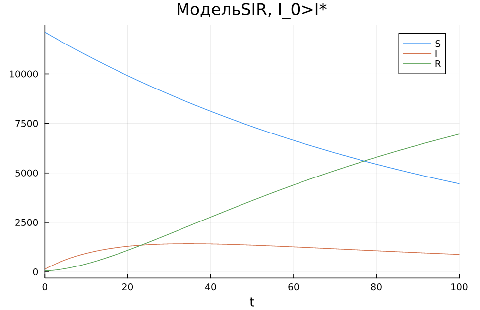

---
## Front matter
title: "Лабораторная работа №6"
subtitle: "Математическое моделирование"
author: "Александрова Ульяна Вадимовна"

## Generic otions
lang: ru-RU
toc-title: "Содержание"

## Bibliography
bibliography: bib/cite.bib
csl: pandoc/csl/gost-r-7-0-5-2008-numeric.csl

## Pdf output format
toc: true # Table of contents
toc-depth: 2
lof: true # List of figures
lot: false # List of tables
fontsize: 12pt
linestretch: 1.5
papersize: a4
documentclass: scrreprt
## I18n polyglossia
polyglossia-lang:
  name: russian
  options:
	- spelling=modern
	- babelshorthands=true
polyglossia-otherlangs:
  name: english
## I18n babel
babel-lang: russian
babel-otherlangs: english
## Fonts
mainfont: IBM Plex Serif
romanfont: IBM Plex Serif
sansfont: IBM Plex Sans
monofont: IBM Plex Mono
mathfont: STIX Two Math
mainfontoptions: Ligatures=Common,Ligatures=TeX,Scale=0.94
romanfontoptions: Ligatures=Common,Ligatures=TeX,Scale=0.94
sansfontoptions: Ligatures=Common,Ligatures=TeX,Scale=MatchLowercase,Scale=0.94
monofontoptions: Scale=MatchLowercase,Scale=0.94,FakeStretch=0.9
mathfontoptions:
## Biblatex
biblatex: true
biblio-style: "gost-numeric"
biblatexoptions:
  - parentracker=true
  - backend=biber
  - hyperref=auto
  - language=auto
  - autolang=other*
  - citestyle=gost-numeric
## Pandoc-crossref LaTeX customization
figureTitle: "Рис."
tableTitle: "Таблица"
listingTitle: "Листинг"
lofTitle: "Список иллюстраций"
lotTitle: "Список таблиц"
lolTitle: "Листинги"
## Misc options
indent: true
header-includes:
  - \usepackage{indentfirst}
  - \usepackage{float} # keep figures where there are in the text
  - \floatplacement{figure}{H} # keep figures where there are in the text
---

# Цель работы

Построить модели эпидемии SIR на языке Julia.

# Задание

**Вариант 35.**

На одном острове вспыхнула эпидемия. Известно, что из всех проживающих на острове 
$(N=12300)$ в момент начала эпидемии $(t=0)$ число заболевших людей 
(являющихся распространителями инфекции) $I(0)=140$, А число здоровых людей с иммунитетом 
к болезни $R(0)=54$. Таким образом, число людей восприимчивых к болезни, 
но пока здоровых, в начальный момент времени $S(0)=N-I(0)-R(0)$.
Постройте графики изменения числа особей в каждой из трех групп.

Рассмотрите, как будет протекать эпидемия в случае:

1.	$I(0)< I^*$

2.	$I(0)>I^*$


# Теоретическое введение

Рассмотрим простейшую модель эпидемии. Предположим, что некая популяция, состоящая из $N$ особей, (считаем, что популяция изолирована) подразделяется на три группы. Первая группа - это восприимчивые к болезни, но пока здоровые особи, обозначим их через $S(t)$. Вторая группа – это число инфицированных особей, которые также при этом являются распространителями инфекции, обозначим их $I(t)$. А третья группа, обозначающаяся через $R(t)$ – это здоровые особи с иммунитетом к болезни. 
До того, как число заболевших не превышает критического значения $I^*$, считаем, что все больные изолированы и не заражают здоровых. Когда $I(t)> I^*$, тогда инфицирование способны заражать восприимчивых к болезни особей. 

Таким образом, скорость изменения числа $S(t)$ меняется по следующему закону:

$$
\frac{dS}{dt}=
 \begin{cases}
	-\alpha S &\text{,если $I(t) > I^*$}
	\\   
	0 &\text{,если $I(t) \leq I^*$}
 \end{cases}
$$

Поскольку каждая восприимчивая к болезни особь, которая, в конце концов, заболевает, сама становится инфекционной, то скорость изменения числа инфекционных особей представляет разность за единицу времени между заразившимися и теми, кто уже болеет и лечится, то есть:

$$
\frac{dI}{dt}=
 \begin{cases}
	\alpha S -\beta I &\text{, если $I(t) > I^*$}
	\\   
	-\beta I &\text{, если $I(t) \leq I^*$}
 \end{cases}
$$

А скорость изменения выздоравливающих особей (при этом приобретающие иммунитет к болезни):

$$\frac{dR}{dt} = \beta I$$

Постоянные пропорциональности $\alpha, \beta$ - это коэффициенты заболеваемости и выздоровления соответственно. Для того, чтобы решения соответствующих уравнений определялось однозначно, необходимо задать начальные условия. Считаем, что на начало эпидемии в момент времени $t=0$ нет особей с иммунитетом к болезни $R(0)=0$, а число инфицированных и восприимчивых к болезни особей $I(0)$ и $S(0)$ соответственно. Для анализа картины протекания эпидемии необходимо рассмотреть два случая:  $I(0) \leq I^*$ и  $I(0)>I^*$

# Выполнение лабораторной работы

Напишем код для случая $I(0)< I^*$:

```Julia
using DifferentialEquations, Plots;

N = 12300
t = 0
I_0 = 140
R_0 = 54
S_0 = N - I_0 - R_0
p = [0.01, 0.06]
u0 = [S_0, I_0, R_0]
tspan = (0, 100)

function SIR(u, p, t) # если I_0<I*
    S, I, R = u
    a, b = p
    N = S + I + R
    dS = 0
    dI = -b*I
    dR = b*I
    return [dS, dI, dR]
end  

odu = ODEProblem(SIR, u0, tspan, p)
result = solve(odu, Tsit5())

plot(result, title = "МодельSIR, I_0<I*", label = ["S" "I" "R"], dpi = 300)

```

В результате работы модели получим следующий график (рис. [-@fig:001]).

{#fig:001 width=70%}

Напишем код для случая $I(0)> I^*$:

```Julia
using DifferentialEquations, Plots;

N = 12300
t = 0
I_0 = 140
R_0 = 54
S_0 = N - I_0 - R_0
p = [0.01, 0.06]
u0 = [S_0, I_0, R_0]
tspan = (0, 100)

function SIR1(u, p, t) # если I_0>I*
    S, I, R = u
    a, b = p
    N = S + I + R
    dS = -a*S
    dI = a*S - b*I
    dR = b*I
    return [dS, dI, dR]
end  

odu2 = ODEProblem(SIR1, u0, tspan, p)
result2 = solve(odu2, Tsit5())

plot(result2, title = "МодельSIR, I_0>I*", label = ["S" "I" "R"], dpi = 300)
```

В результате работы модели получим следующий график (рис. [-@fig:002]).

{#fig:002 width=70%}

# Выводы

Из графиков следует, что при изолировании системы число здоровых особей не изменяется, так как их некому заразить. В неизолированной модели показатели численности здоровых падаю в зависимости от числа заболевших (и наоборот).

Я посмтроила модели и провела их анализ.

# Список литературы

[Лабораторная работа №6](https://esystem.rudn.ru/mod/resource/view.php?id=1222506)

[Задания к лабораторной работе](https://esystem.rudn.ru/mod/resource/view.php?id=1222507)
