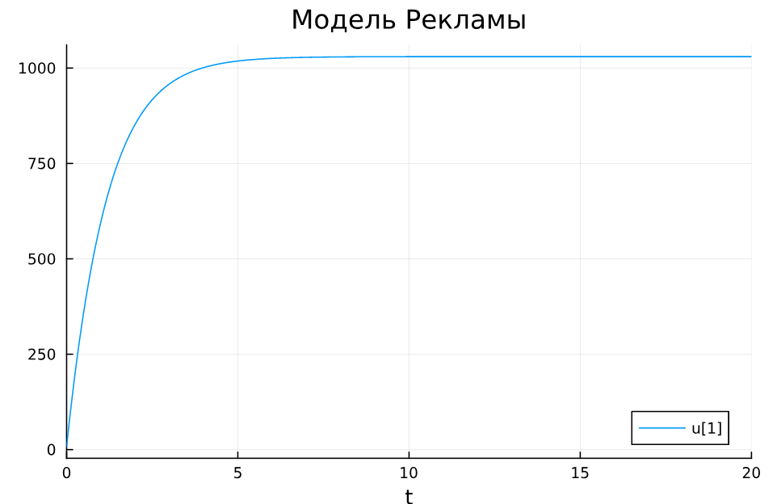
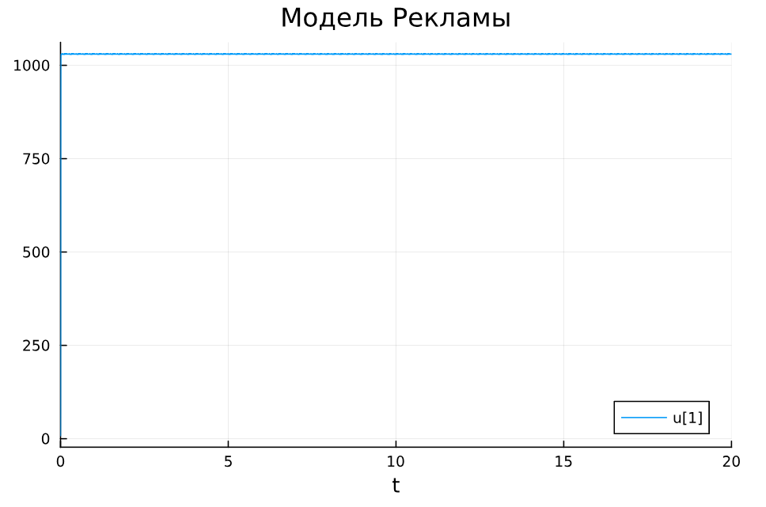
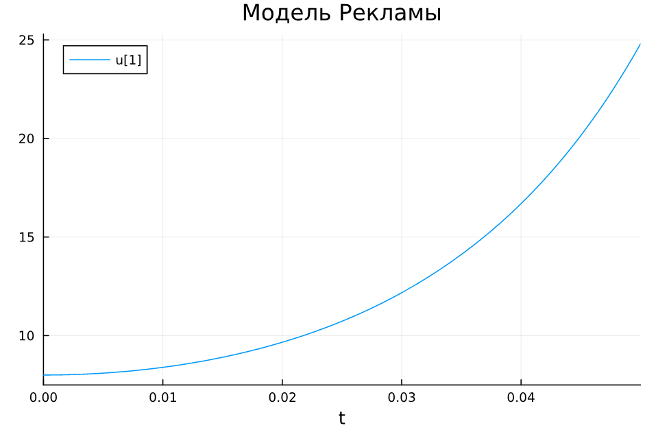

---
## Front matter
title: "Лабораторная работа №7"
subtitle: "Математическое моделирование"
author: "Александрова Ульяна Вадимовна"

## Generic otions
lang: ru-RU
toc-title: "Содержание"

## Bibliography
bibliography: bib/cite.bib
csl: pandoc/csl/gost-r-7-0-5-2008-numeric.csl

## Pdf output format
toc: true # Table of contents
toc-depth: 2
lof: true # List of figures
lot: false # List of tables
fontsize: 12pt
linestretch: 1.5
papersize: a4
documentclass: scrreprt
## I18n polyglossia
polyglossia-lang:
  name: russian
  options:
	- spelling=modern
	- babelshorthands=true
polyglossia-otherlangs:
  name: english
## I18n babel
babel-lang: russian
babel-otherlangs: english
## Fonts
mainfont: IBM Plex Serif
romanfont: IBM Plex Serif
sansfont: IBM Plex Sans
monofont: IBM Plex Mono
mathfont: STIX Two Math
mainfontoptions: Ligatures=Common,Ligatures=TeX,Scale=0.94
romanfontoptions: Ligatures=Common,Ligatures=TeX,Scale=0.94
sansfontoptions: Ligatures=Common,Ligatures=TeX,Scale=MatchLowercase,Scale=0.94
monofontoptions: Scale=MatchLowercase,Scale=0.94,FakeStretch=0.9
mathfontoptions:
## Biblatex
biblatex: true
biblio-style: "gost-numeric"
biblatexoptions:
  - parentracker=true
  - backend=biber
  - hyperref=auto
  - language=auto
  - autolang=other*
  - citestyle=gost-numeric
## Pandoc-crossref LaTeX customization
figureTitle: "Рис."
tableTitle: "Таблица"
listingTitle: "Листинг"
lofTitle: "Список иллюстраций"
lotTitle: "Список таблиц"
lolTitle: "Листинги"
## Misc options
indent: true
header-includes:
  - \usepackage{indentfirst}
  - \usepackage{float} # keep figures where there are in the text
  - \floatplacement{figure}{H} # keep figures where there are in the text
---

# Цель работы

Построить простейшую математическую модель эффективности рекламы.

# Задание

**Вариант 35.**

Постройте график распространения рекламы, математическая модель которой описывается следующим уравнением:

1. $\frac{dn}{dt} = (0.83 + 0.000083(t)n(t))(N-n(t))$
2. $\frac{dn}{dt} = (0.000083 + 0.83(t)n(t))(N-n(t))$
3. $\frac{dn}{dt} = (0.83*sin(t) + 0.83*sin(t)n(t))(N-n(t))$

При этом объем аудитории $N = 1030$, в начальный момент о товаре знает $8$ человек. Для случая 2 определите в какой момент времени скорость распространения рекламы будет иметь максимальное значение.

# Теоретическое введение

Организуется рекламная кампания нового товара или услуги. Необходимо, чтобы прибыль будущих продаж с избытком покрывала издержки на рекламу. Вначале расходы могут превышать прибыль, поскольку лишь малая часть потенциальных покупателей будет информирована о новинке. Затем, при увеличении числа продаж, возрастает и прибыль, и, наконец, наступит момент, когда рынок насытиться, и рекламировать товар станет бесполезным.

Предположим, что торговыми учреждениями реализуется некоторая продукция, о которой в момент времениt из числа потенциальных покупателей $N$ знает лишь $n$ покупателей. Для ускорения сбыта продукции запускается реклама по радио, телевидению и других средств массовой информации. После запуска рекламной кампании информация о продукции начнет распространяться среди потенциальных покупателей путем общения друг с другом. Таким образом, после запуска рекламных объявлений скорость изменения числа знающих о продукции людей пропорциональна как числу знающих о товаре покупателей, так и числу покупателей о нем не знающих.

Модель рекламной кампании описывается следующими величинами. Считаем, что $\dfrac{dn}{dt}$ - скорость изменения со временем числа потребителей, узнавших о товаре и готовых его купить,$t$ - время, прошедшее с начала рекламной кампании, $n(t)$ - число уже информированных клиентов. Эта величина пропорциональна числу покупателей, еще не знающих о нем, это описывается следующим образом: $\alpha _1 (t)(N-n(t))$, где $N$ - общее число потенциальных платежеспособных покупателей, $\alpha _1 (t)$ - характеризует интенсивность рекламной кампании (зависит от затрат на рекламу в данный момент времени). Помимо этого, узнавшие о товаре потребители также распространяют полученную информацию среди потенциальных покупателей, не знающих о нем (в этом случае работает т.н. сарафанное радио). Этот вклад в рекламу описывается величиной $\alpha _2 (t)n(t)(N-n(t))$, эта величина увеличивается с увеличением потребителей узнавших о товаре. Математическая модель распространения рекламы описывается уравнением[@Samarsci2001]: 

$$
\frac{dn}{dt} = (\alpha _1 + \alpha _2 (t)n(t))(N-n(t))
$$

При $\alpha _1 > \alpha _2$ получается модель типа модели Мальтуса. При $\alpha_2 > \alpha_1$ получаем уравнение логистической кривой.

# Выполнение лабораторной работы

Напишем код для решения дифференциальных уроавнений и построения графика на языке Julia:

```Julia
using DifferentialEquations, Plots;


tspan1 = (0, 20)
tspan2 = (0, 0.05)
p1 = [0.83, 0.000083, 1030]
p2 = [0.000083, 0.83, 1030]
p3 = [0.83, 0.83, 1030]
n0 = 8

f(n,p,t) = (p[1] + p[2]*n)*(p[3]-n)
f2(n,p,t) = (p[1]*sin(t) + p[2]*sin(t)*n)*(p[3]-n)


odu = ODEProblem(f, n0, tspan1, p1)
result = solve(odu, Tsit5())
    
odu2 = ODEProblem(f, n0, tspan1, p2)
result2 = solve(odu2, Tsit5())
    
odu3 = ODEProblem(f2, n0, tspan2, p3)
result3 = solve(odu3, Tsit5())

plot(result, title = "Модель Рекламы", dpi = 300)
plot2(result2, title = "Модель Рекламы", dpi = 300)
plot3(result3, title = "Модель Рекламы", dpi = 300)
```

В результате моделирования мы получим несколько графиков (рис. [-@fig:001]), (рис. [-@fig:002]), (рис. [-@fig:003]).

{#fig:001 width=70%}

По графику мы видим, что распределение рекламы резко увеличивается в первые 5 единиц времени, но затем рост останавливается, то есть происходит насыщение рынка рекламой, потому как мы достигли числа в 1030 человек.

{#fig:002 width=70%}

По второму графику заметно, что насыщение происходит почти сразу.

{#fig:003 width=70%}

По третьему графику видно, что насыщение происходит по кривой.

# Вывод

Я построила простешую модель рекламы на языке Julia.
