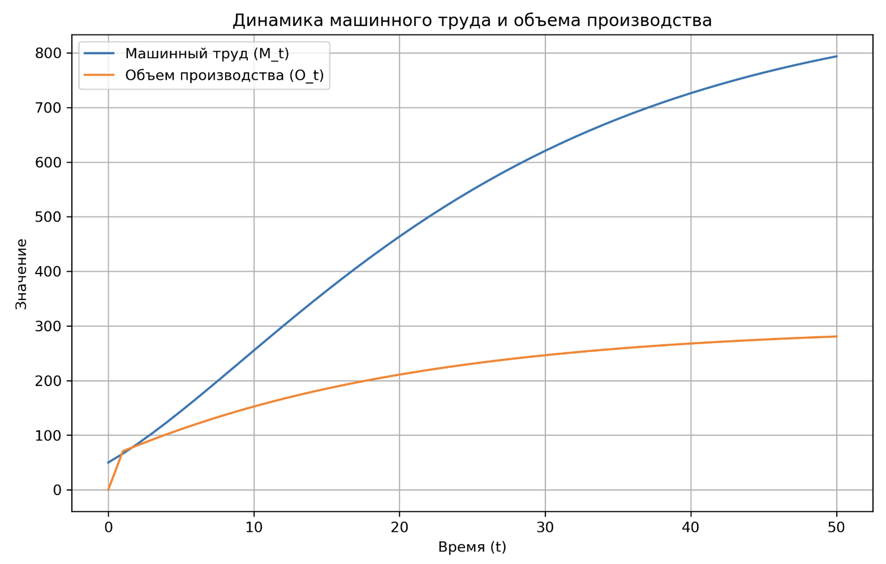

---
## Front matter
lang: ru-RU
title: Базовая модель экономического роста
subtitle: Математическое моделирование
author:
  - Александрова УВ
institute:
  - Российский университет дружбы народов, Москва, Россия
date: 21 марта 2025

## i18n babel
babel-lang: russian
babel-otherlangs: english

## Formatting pdf
toc: false
toc-title: Содержание
slide_level: 2
aspectratio: 169
section-titles: true
theme: metropolis
header-includes:
 - \metroset{progressbar=frametitle,sectionpage=progressbar,numbering=fraction}
---

# Информация

## Докладчик

:::::::::::::: {.columns align=center}
::: {.column width="70%"}

  * Александрова Ульяна
  * студентка 3го курса
  * Факультет физико-математических и естественных наук
  * Российский университет дружбы народов
  * [1132226444@rudn.ru](mailto:1132226444@rudn.ru)

:::
::: {.column width="30%"}

:::
::::::::::::::

# Основные аспекты экономического роста

**Экономический рост** — это увеличение или улучшение экономики, скорректированной на инфляцию, в течение финансового года [1].

##

:::::::::::::: {.columns align=center}
::: {.column width="50%"}

**Измерение роста**:

   - Экономический рост измеряется с использованием национальных счетов доходов.
   
   - Реальный ВВП на душу населения;
   
   - Интенсивный рост;
   
   - Экстенсивный рост;
   
   - Долгосрочный рост;
   
   - Краткосрочные изменения;

:::
::: {.column width="50%"}

![Исторический мировой ВВП на душу населения [1]](image/2.png)

:::
::::::::::::::

## 

:::::::::::::: {.columns align=center}
::: {.column width="50%"}

![Бизнесс-цикл [4]](image/4.png)

:::
::: {.column width="50%"}

**Бизнес-цикл**, также известный как экономический цикл, представляет собой периодические колебания уровня экономической активности в стране или регионе. Эти колебания включают периоды роста (подъема) и спада (рецессии) в экономике.

:::
::::::::::::::

## Базовая Модель

**Базовая модель экономического роста** описывает, как изменяется количество производимых товаров и услуг с течением времени. Этот показатель обычно измеряется в процентах от валового внутреннего продукта (ВВП)

## Применение модели

1. Анализ экономического роста стран;

2. Планирование инвестиций;

3. Оценка влияния политики.

## Факторы роста

:::::::::::::: {.columns align=center}
::: {.column width="50%"}

![Основные факторы роста и их влияние на рост экономики [4]](image/3.png)

:::
::: {.column width="50%"}

1. Технологический прогресс

2. Инвестиции

3. Человеческий капитал

4. Институциональные факторы

5. Демографические факторы

:::
::::::::::::::

# Построение модели

## Постановка задачи

Модель включает следующие параметры:

- $L_t$ — труд работников в момент времени $t$;

- $M_t$ — труд машин в момент времени $t$;

- $O_t$ — выходное значение модели (объем производства) в момент времени $t$;

- $E_t$ — потребленные ресурсы в момент времени $t$;

- $I_t$ — инвестиции в момент времени $t$;

- $s$ — ставка сбережений (доля дохода, направляемая на инвестиции);

- $d$ — норма амортизации (износ капитала).

## Выход модели (объем производства)

$$
O_t = \sqrt{L_t \cdot M_t}.
$$

## Инвестиции и потребление

$$
I_t = s \cdot O_t,
$$

где $s$ — ставка сбережений.

Потребление ресурсов $E_t$ связано с объемом производства следующим образом:

$$
O_t = E_t + I_t.
$$

## Динамика машинного труда

$$
M_{t+1} = M_t + I_t - d \cdot M_t,
$$

где:
- $I_t$ — инвестиции, увеличивающие машинный труд;
- $d \cdot M_t$ — амортизация, уменьшающая машинный труд.

## Динамика труда человека

$$
L_{t+1} = (1 + n) \cdot L_t.
$$

Для простоты будем считать, что $n = 0$, то есть труд человека постоянен: $L_t = L_0$.

## Устойчивое состояние модели

$$
I_t = d \cdot M_t.
$$

Подставляя выражение для инвестиций $I_t = s \cdot O_t$, получаем:

$$
s \cdot O_t = d \cdot M_t.
$$

## 

С учетом производственной функции $O_t = \sqrt{L_t \cdot M_t}$, это уравнение позволяет определить устойчивый уровень машинного труда $M^*$ и объема производства $O^*$:

$$
s \cdot \sqrt{L_t \cdot M^*} = d \cdot M^*.
$$

Решая это уравнение, находим:

$$
M^* = \frac{s^2 \cdot L_t}{d^2}.
$$

Соответственно, устойчивый объем производства:

$$
O^* = \sqrt{L_t \cdot M^*} = \frac{s \cdot L_t}{d}.
$$

## Пример численного анализа

- $L_t = 100$ (постоянный труд человека);

- $s = 0.3$ (ставка сбережений 30%);

- $d = 0.1$ (норма амортизации 10%).

Устойчивый уровень машинного труда:

$$
M^* = \frac{0.3^2 \cdot 100}{0.1^2} = \frac{9}{0.01} = 900.
$$

Устойчивый объем производства:

$$
O^* = \frac{0.3 \cdot 100}{0.1} = 300.
$$

## Реализация модели на Python

{ width=70%}

# Улучшение модели

1. Включение технологического прогресса

$$
O_t = A_t \cdot \sqrt{L_t \cdot M_t}
$$

2. Учет человеческого капитала

$$O_t = \sqrt{L_t \cdot M_t \cdot H_t}$$

3. Введение демографических факторов

$$O_t = \sqrt{L_t \cdot M_t \cdot P_t}$$

## 

:::::::::::::: {.columns align=center}
::: {.column width="50%"}

![Влияние экологических факторов на рост экономики [1]](image/6.jpg)

:::
::: {.column width="50%"}

4. Экологические факторы

$$
O_t = \sqrt{L_t \cdot M_t \cdot E_t}
$$

5. Учет международной торговли

$$
O_t = \sqrt{L_t \cdot M_t \cdot (X_t - M_t)}
$$

:::
:::::::::::::: 

# Выводы

Базовая модель экономического роста является важным инструментом для анализа и прогнозирования экономического развития. Она помогает понять, как различные факторы, такие как труд, инвестиции и амортизация, влияют на производство товаров и услуг. Современные модели экономического роста включают в себя множество факторов, что позволяет более точно прогнозировать развитие экономики и учитывать влияние различных факторов на экономический рост.

# Источники литературы

1. [Economic growth. Wikipedia](https://en.wikipedia.org/wiki/Economic_growth#Unified_growth_theory)
2. [Основные модели экономического роста](https://spravochnick.ru/ekonomika/osnovnye_modeli_ekonomicheskogo_rosta/)
3. [Экономический рост. Модели экономического роста](https://cyberleninka.ru/article/n/ekonomicheskiy-rost-modeli-ekonomicheskogo-rosta)
4. [Reserve Bank Of Australia](https://www.rba.gov.au/education/resources/explainers/economic-growth.html)
5. [Модель Солоу](https://ru.wikipedia.org/wiki/%D0%9C%D0%BE%D0%B4%D0%B5%D0%BB%D1%8C_%D0%A1%D0%BE%D0%BB%D0%BE%D1%83#%D0%91%D0%B0%D0%B7%D0%BE%D0%B2%D1%8B%D0%B5_%D0%BF%D1%80%D0%B5%D0%B4%D0%BF%D0%BE%D1%81%D1%8B%D0%BB%D0%BA%D0%B8_%D0%BC%D0%BE%D0%B4%D0%B5%D0%BB%D0%B8)

